# 🍌 Banana Bun

<div align="center">
  
</div>

Banana Bun is a whimsical, developer-first project that uses **local AI models** to help users automatically **tag, organize, and search their media files** — audio, video, images, or docs — all while keeping privacy at the core. Built on Bun for speed and simplicity, it combines local LLMs, computer vision, and vector search into a single elegant pipeline.

**🚀 Enhanced with AI-Powered Intelligence:** Featuring 11 specialized MCP servers with 25+ AI tools for metadata optimization, pattern analysis, resource optimization, content quality enhancement, and privacy-aware user behavior analysis — transforming your media library into an intelligent, self-optimizing system.

## 🌐 Architecture Overview



* **Task Orchestrator**: The central engine (`index.ts`) that watches for new media or task files and dispatches them through the processing pipeline. It uses a **Retry Manager** to handle retries, checks dependencies among tasks, and updates task status. Tasks flow from ingestion to processing, then to indexing and search.
* **Media Processors**: Dedicated workers for handling different media types (e.g. video, audio, images). They extract frames, audio, etc., and pass data to AI services.
* **AI Services**: Local multimodal models. For example, **Whisper** is used for transcription, and vision models (CLIP/OpenL3) for embeddings and tagging. These services produce transcripts, embeddings, tags, and summaries.
* **Search Engines**: Hybrid search combining **ChromaDB** (vector embedding search) and **MeiliSearch** (full-text search). Ingested media and metadata are indexed here, enabling semantic and keyword search.
* **Database**: SQLite (via Bun) stores all persistent data: media metadata, task records, logs, user feedback, tags, scheduling rules, and so on.
* **AnalyticsLogger**: A subsystem logging every task’s lifecycle (status, duration, errors) into a `task_logs` table. This enables CLI analytics tools to compute performance metrics, bottlenecks, and trends over time.
* **Task Scheduler & Rule Engine**: Periodic tasks (via cron-like schedules) are managed by the Task Scheduler. Enhanced learning can auto-generate scheduling rules (via LLM assistance) stored in the database. CLI tools exist to generate or apply these rules.
* **Enhanced Learning Service**: An autonomous service that learns from usage and feedback. It generates "enhanced learning rules" to improve tagging, transcription, and scheduling based on detected patterns. These rules can be auto-applied to future tasks.
* **Feedback System**: Users can provide feedback (e.g., correcting tags or transcripts). The **Feedback Tracker** collects this feedback, analyzes patterns, and feeds it into the Enhanced Learning pipeline to refine future predictions.
* **Monitoring & Dashboard**: Real-time monitoring is provided via two WebSocket servers (Enhanced Task Processor WebSocket and Monitor WebSocket) that broadcast task status updates to a live dashboard (`live-dashboard.html`).
* **MCP Servers (Model Context Protocol)**: A comprehensive suite of subprocess servers (spawned via `mcp-manager`) exposing advanced AI-powered capabilities via JSON-RPC over `stdin/stdout`. These include:

  * **Whisper MCP**: Smart transcription and quality analysis tools.
  * **ChromaDB MCP**: Vector search tools (e.g. finding similar tasks).
  * **MeiliSearch MCP**: Intelligent search enhancement tools.
  * **Media Intelligence MCP**: Cross-modal insights (content discovery, tagging optimization, user behavior analytics, recommendations).
  * **LLM Planning MCP**: Generates optimized task plans or resource allocation using an LLM.
  * **Monitor MCP**: Provides system metrics, task status queries, and broadcast capabilities.
  * **Metadata Optimization MCP**: AI-powered metadata quality analysis, enhancement, and consistency validation with learning capabilities.
  * **Pattern Analysis MCP**: Identifies and leverages system usage patterns for temporal analysis, scheduling optimization, and predictive insights.
  * **Resource Optimization MCP**: Real-time resource monitoring, load balancing, bottleneck prediction, and performance optimization.
  * **Content Quality MCP**: Comprehensive media quality assessment, enhancement recommendations, and quality trend tracking.
  * **User Behavior MCP**: Privacy-aware user interaction analysis, personalization recommendations, and engagement optimization.

All components interact to form a privacy-first, local AI-driven media organization pipeline.

## 🚀 Quick Start

### Prerequisites
- **Bun** runtime (latest version)
- **Node.js** 18+ (for some dependencies)
- **Python** 3.8+ (for AI services)
- **Git** (for cloning)

### Installation & Setup

1. **Clone the repository:**
   ```bash
   git clone https://github.com/dlkesterson/banana-bun.git
   cd banana-bun
   ```

2. **Run the setup script (cross-platform):**
   ```bash
   # Automatic platform detection
   npm run setup

   # Or run platform-specific scripts directly:
   # Windows: setup.bat or scripts/windows/setup-windows.ps1
   # Linux/macOS: ./setup.sh or ./scripts/linux/setup-linux.sh
   ```

3. **Configure environment:**
   ```bash
   # Copy and edit the environment file
   cp .env.example .env
   # Edit .env with your preferred paths and API keys
   ```

4. **Start services and run:**
   ```bash
   # Recommended: Automatic service management
   npm run dev:with-services

   # Or manual service management:
   npm run services:start  # Start external services
   npm run dev             # Run development server
   npm run services:stop   # Stop services when done
   ```

### External Services

Banana Bun requires these external services (automatically managed by setup scripts):

- **Ollama** (localhost:11434) - Local LLM service
- **ChromaDB** (localhost:8000) - Vector database for embeddings
- **MeiliSearch** (localhost:7700) - Full-text search engine

The application will automatically check service health on startup and provide guidance if any services are missing.

### Development Workflow

```bash
# Start everything with automatic service management
npm run dev:with-services

# Or manage services manually
npm run services:start    # Start all external services
npm run dev              # Start development server with file watching
npm run services:stop    # Stop all services when done

# Other useful commands
npm run setup           # Re-run setup if needed
npm run services:start  # Start services only
npm run services:stop   # Stop services only
```

## 🛠 CLI Commands

Banana Bun provides numerous CLI scripts under `src/cli/`. Each tool can be run with `bun run`, and supports flags and options as documented below. (Replace `src/cli/` with the actual path if needed.)

* ### **analyze-activity-patterns.ts** (Analyze Activity Patterns)

  * **Description:** Analyzes historical system activity (e.g. media views, searches, tasks) to identify temporal or user-behavior patterns that could inform scheduling or recommendations.
  * **Flags/Options:**

    * `--days <number>`   – Time window in days to analyze (default \~30).
    * `--min-confidence <0–1>` – Minimum pattern confidence to report.
    * `--use-model <model>` – Specify LLM for pattern analysis (e.g. `ollama`, `openai`).
    * `--help` – Show help.
  * **Examples:**

    ```bash
    bun run analyze-activity-patterns --days 14 --min-confidence 0.7
    bun run analyze-activity-patterns --use-model "openai" --min-confidence 0.8
    ```

* ### **analyze-cross-modal-intelligence.ts**

  * **Description:** Uses the Media Intelligence MCP to generate cross-modal insights (correlations between search, transcription, and tagging) for specified media or overall content usage.
  * **Flags/Options:**

    * `--media-id <id>` – (Required) Media ID to analyze.
    * `--time-range <hours>` – Time window for data (default 168).
    * `--recommendations` – Include AI-driven content recommendations in output.
    * `--help` – Show help.
  * **Examples:**

    ```bash
    bun run analyze-cross-modal-intelligence --media-id 123
    bun run analyze-cross-modal-intelligence --media-id 456 --time-range 72 --recommendations
    ```

* ### **analyze-feedback-enhanced.ts**

  * **Description:** Performs advanced analysis of user feedback patterns and generates enhanced learning rules to correct tags or metadata automatically.
  * **Flags/Options:**

    * `--min-frequency <n>` – Minimum occurrences for a pattern (default \~3).
    * `--confidence <0–1>` – Confidence threshold for rules (default \~0.8).
    * `--strategy <type>` – Learning strategy, e.g. `temporal`, `cross_modal`.
    * `--generate-rules` – Generate new rules from detected feedback patterns.
    * `--apply-rules` – Automatically apply high-confidence rules.
    * `--media-id <id>` – Restrict analysis to a specific media item.
    * `--dry-run` – Show what would happen without applying changes.
    * `--help` – Show help.
  * **Examples:**

    ```bash
    bun run analyze-feedback-enhanced --generate-rules
    bun run analyze-feedback-enhanced --apply-rules --min-frequency 5 --confidence 0.85
    ```

* ### **analyze-system-performance.ts**

  * **Description:** Summarizes overall system performance from task logs (success rates, durations, common failures).
  * **Flags/Options:**

    * `--days <number>` – Days of logs to analyze (default 1).
    * `--min-severity <level>` – Filter issues by severity (`low`, `medium`, `high`, `critical`).
    * `--bottlenecks-only` – Show only identified bottlenecks.
    * `--generate-recommendations` – Use LLM to suggest improvements.
    * `--output <file>` – Write report to file.
    * `--format <type>` – Output format (`text`, `json`, `markdown`).
    * `--help` – Show help.
  * **Examples:**

    ```bash
    bun run analyze-system-performance
    bun run analyze-system-performance --days 7 --min-severity high --generate-recommendations
    bun run analyze-system-performance --output perf-report.md --format markdown
    ```

* ### **analyze-task-metrics.ts**

  * **Description:** Breaks down task execution metrics, trends, and identifies slow tasks or bottlenecks.
  * **Flags/Options:**

    * `--hours <number>` – Hours of logs to analyze (default 24).
    * `--trends` – Display trends over time.
    * `--days <number>` – For trend analysis span (default 7).
    * `--bottlenecks` – Highlight tasks exceeding threshold.
    * `--threshold <ms>` – Slow-task threshold in ms (default 30000).
    * `--cleanup` – Remove old log entries.
    * `--keep-days <n>` – Days of logs to keep when cleaning (default 30).
    * `--help` – Show help.
  * **Examples:**

    ```bash
    bun run analyze-task-metrics --hours 48 --bottlenecks --threshold 60000
    bun run analyze-task-metrics --trends --days 14
    bun run analyze-task-metrics --cleanup --keep-days 15
    ```

* ### **banana-audio-analyze.ts**

  * **Description:** Analyze audio files using Whisper for transcription, or advanced audio embeddings.
  * **Flags/Options:**

    * `--media <id>` – (Optional) Media ID to analyze, else a file path.
    * `--output <file>` – Save transcript or analysis to a file.
    * `--language <code>` – Force language code or `auto`.
    * `--help` – Show help.
  * **Examples:**

    ```bash
    bun run banana-audio-analyze.ts --media 123
    bun run banana-audio-analyze.ts /path/to/audio.wav --language en --output transcript.txt
    ```

* ### **banana-detect-objects.ts**

  * **Description:** Detects objects in video scenes using TensorFlow\.js/COCO. Processes either one scene or all scenes of a media.
  * **Flags/Options:**

    * `--scene <id>` – Scene ID to process.
    * `--media <id>` – Media ID to process all scenes.
    * `--all-scenes` – (Use with `--media`) process every scene.
    * `--confidence <0–1>` – Minimum detection confidence (default 0.5).
    * `--force` – Redetect even if objects are already stored.
    * `--direct` – Run immediately instead of scheduling a task.
    * `--help, -h` – Show help.
  * **Examples:**

    ```bash
    bun run banana-detect-objects.ts --scene 123
    bun run banana-detect-objects.ts --media 456 --all-scenes --confidence 0.7
    bun run banana-detect-objects.ts --scene 123 --force
    ```

* ### **banana-detect-scenes.ts**

  * **Description:** Splits a video into scenes/keyframes. Stores detected scenes for further analysis.
  * **Flags/Options:**

    * `--media <id>` – Media ID to detect scenes.
    * `--threshold <value>` – Scene change sensitivity.
    * `--help` – Show help.
  * **Examples:**

    ```bash
    bun run banana-detect-scenes.ts --media 123
    bun run banana-detect-scenes.ts --media 123 --threshold 0.4
    ```

* ### **banana-embed-media.ts**

  * **Description:** Generates and stores CLIP/OpenL3 embeddings for images or audio.
  * **Flags/Options:**

    * `--media <id>` – Media ID to embed.
    * `--direct` – Process immediately (bypass queue).
    * `--help` – Show help.
  * **Examples:**

    ```bash
    bun run banana-embed-media.ts --media 123
    bun run banana-embed-media.ts --media 123 --direct
    ```

* ### **banana-recommend.ts**

  * **Description:** Provides AI-powered content recommendations (e.g. next media to view) based on usage history or current item.
  * **Flags/Options:**

    * `--media <id>` – (Optional) Base media ID for personalized suggestions.
    * `--type <mode>` – Recommendation type (`similar`, `trending`, `personalized`).
    * `--max <n>` – Max recommendations (default \~5).
    * `--help` – Show help.
  * **Examples:**

    ```bash
    bun run banana-recommend.ts --media 123 --type similar --max 10
    bun run banana-recommend.ts --type trending
    ```

* ### **banana-search-similar.ts**

  * **Description:** Finds media similar to given query or media using semantic search. Utilizes the MCP search tools.
  * **Flags/Options:**

    * `--query "<text>"` – Search query for similar content.
    * `--media <id>` – Media ID to find similar media to.
    * `--limit <n>` – Number of results (default 10).
    * `--semantic` – Use vector search (Chroma) instead of text search.
    * `--help` – Show help.
  * **Examples:**

    ```bash
    bun run banana-search-similar.ts --query "holiday beach"
    bun run banana-search-similar.ts --media 123 --limit 5
    ```

* ### **banana-summarize.ts**

  * **Description:** Uses an LLM to summarize text documents or transcripts.
  * **Flags/Options:**

    * `--file <path>` – Path to text or transcript file.
    * `--prompt "<text>"` – Custom prompt or context.
    * `--model <name>` – LLM model to use (e.g. `qwen3:8b`).
    * `--help` – Show help.
  * **Examples:**

    ```bash
    bun run banana-summarize.ts --file notes.txt
    bun run banana-summarize.ts --prompt "Summarize the following session..."
    ```

* ### **download-media.ts**

  * **Description:** Downloads media from external sources (e.g. YouTube) into the local collection.
  * **Flags/Options:**

    * `--source <type>` – Source type (`youtube`, `vimeo`, etc.).
    * `--url "<URL>"` – URL of the media to download.
    * `--output <path>` – Output directory or file name.
    * `--help` – Show help.
  * **Examples:**

    ```bash
    bun run download-media.ts --source youtube --url "https://youtube.com/watch?v=..."
    ```

* ### **generate-optimized-plan.ts**

  * **Description:** An interactive CLI to build optimized multi-step task plans using LLM planning service.
  * **Flags/Options:**

    * `--goals "<text>"` – Describe the goal of the plan (required).
    * `--context "<text>"` – Additional context or constraints.
    * `--model <name>` – LLM model to use.
    * `--max-subtasks <n>` – Limit number of subtasks (default 10).
    * `--dry-run` – Show plan without saving.
    * `--help` – Show help.
  * **Examples:**

    ```bash
    bun run generate-optimized-plan.ts --goals "Organize media by date and theme"
    bun run generate-optimized-plan.ts --goals "Improve search accuracy" --model qwen3:8b
    ```

* ### **generate-scheduling-rules.ts**

  * **Description:** Generates and optionally auto-enables scheduling rules from detected patterns using LLM assistance.
  * **Flags/Options:**

    * `--from-patterns` – Generate from all high-confidence patterns (default true).
    * `--pattern-ids "<ids>"` – Comma-separated specific pattern IDs.
    * `--auto-enable` – Automatically enable new rules.
    * `--use-model <ollama|openai|both>` – LLM choice (default `ollama`).
    * `--min-confidence <0–1>` – Minimum pattern confidence (default 0.8).
    * `--max-rules <n>` – Max rules to generate (default 10).
    * `--conflict-strategy <priority|merge|disable_lower>` – How to resolve rule conflicts (default `priority`).
    * `--dry-run` – Show results without saving.
    * `--output-format <table|json|detailed>` – Output format (default `table`).
    * `--verbose` – Show detailed info.
    * `--help` – Show help.
  * **Examples:**

    ```bash
    bun run generate-scheduling-rules --min-confidence 0.9 --auto-enable
    bun run generate-scheduling-rules --pattern-ids "1,3,5" --use-model openai --conflict-strategy merge
    bun run generate-scheduling-rules --dry-run --output-format detailed
    ```

* ### **lint-task.ts**

  * **Description:** Validates the syntax and consistency of a task file before execution.
  * **Flags/Options:**

    * `--file <path>` – Path to the task file (.json) to lint.
    * `--help` – Show help.
  * **Examples:**

    ```bash
    bun run lint-task.ts --file new-task.json
    ```

* ### **manage-plan-templates.ts**

  * **Description:** Manage saved plan templates (list, view, delete).
  * **Commands:**

    * `list` – List all saved plan templates.
    * `view <id>` – Show details of a specific template.
    * `delete <id>` – Remove a template.
    * `help` – Show usage.
  * **Examples:**

    ```bash
    bun run manage-plan-templates.ts list
    bun run manage-plan-templates.ts view 3
    bun run manage-plan-templates.ts delete 5
    ```

* ### **media-ingest.ts**

  * **Description:** Ingest a media file or directory into the library, triggering auto-tagging and indexing.
  * **Flags/Options:**

    * `<path>` – (Positional) File or folder to ingest.
    * `--watch` – Continuously watch the directory for new files.
    * `--force` – Force re-ingestion even if already in library.
    * `--help` – Show help.
  * **Examples:**

    ```bash
    bun run media-ingest.ts /path/to/video.mp4
    bun run media-ingest.ts /path/to/media/folder --watch
    ```

* ### **media-intelligence.ts**

  * **Description:** Invokes the Media Intelligence MCP tools to analyze overall content usage (summary of discovery patterns, tagging, etc.).
  * **Flags/Options:**

    * `--time-range <hours>` – Analysis window (default 168 hours).
    * `--detailed` – Include more granular metrics.
    * `--help` – Show help.
  * **Examples:**

    ```bash
    bun run media-intelligence.ts
    bun run media-intelligence.ts --time-range 24 --detailed
    ```

* ### **media-search.ts**

  * **Description:** Search media by keyword or semantic similarity.
  * **Flags/Options:**

    * `<query>` – Search terms (positional).
    * `--semantic` – Use vector-based search (ChromaDB).
    * `--limit <n>` – Number of results (default 10).
    * `--filter <expr>` – Filter by metadata or tags.
    * `--help` – Show help.
  * **Examples:**

    ```bash
    bun run media-search.ts "sunset beach"
    bun run media-search.ts "concert" --semantic --limit 5
    bun run media-search.ts "holiday" --filter "year=2023"
    ```

* ### **media-tags.ts**

  * **Description:** Manage AI-generated tags for media files.
  * **Usage:** `bun run media-tags.ts <command> [options]`
  * **Commands:**

    * `list <file>`  – Show tags for a media file.
    * `add <file> <tags...>` – Add custom tags to a file.
    * `remove <file> <tags...>` – Remove tags from a file.
    * `retag <file>`     – Re-run AI tagging (optionally with explanations).
    * `explain <file>` – Show LLM reasoning for current tags.
  * **Options (global):**

    * `--explain` – Show tag reasoning during a retag.
    * `--force` – Force re-tagging even if tags exist.
    * `--help` – Show help.
  * **Examples:**

    ```bash
    bun run media-tags.ts list /path/to/video.mp4
    bun run media-tags.ts add /path/to/video.mp4 comedy kids
    bun run media-tags.ts remove /path/to/video.mp4 horror
    bun run media-tags.ts retag /path/to/video.mp4 --explain
    bun run media-tags.ts explain /path/to/video.mp4
    ```

* ### **optimize-metadata.ts**

  * **Description:** Runs heuristic checks on metadata (e.g. missing fields, duplicate names).
  * **Flags/Options:**

    * `--fix` – Attempt to auto-fix simple issues.
    * `--help` – Show help.
  * **Examples:**

    ```bash
    bun run optimize-metadata.ts --fix
    ```

* ### **optimize-resource-schedule.ts**

  * **Description:** Analyzes task load and suggests optimal resource scheduling or concurrency settings.
  * **Flags/Options:**

    * `--time-range <hours>` – Analysis window.
    * `--help` – Show help.
  * **Examples:**

    ```bash
    bun run optimize-resource-schedule.ts --time-range 24
    ```

* ### **organize-media.ts**

  * **Description:** Auto-move or categorize media files based on AI-determined themes or dates.
  * **Flags/Options:**

    * `--by-date` – Organize by creation date.
    * `--by-concept` – Organize by AI-extracted theme.
    * `--dry-run` – Show changes without moving files.
    * `--help` – Show help.
  * **Examples:**

    ```bash
    bun run organize-media.ts --by-date
    bun run organize-media.ts --by-concept --dry-run
    ```

* ### **run-feedback-loop.ts**

  * **Description:** Scans user feedback to detect correction patterns and generate learning rules.
  * **Flags/Options:**

    * `--min-frequency <n>` – Pattern frequency threshold (default \~2).
    * `--apply-rules` – Automatically apply existing rules to new media.
    * `--analyze-only` – Only detect patterns without generating rules.
    * `--dry-run` – Don't save new rules.
    * `--help` – Show help.
  * **Examples:**

    ```bash
    bun run run-feedback-loop.ts
    bun run run-feedback-loop.ts --min-frequency 5 --apply-rules
    bun run run-feedback-loop.ts --analyze-only --dry-run
    ```

* ### **schedule-manager.ts**

  * **Description:** Start or stop the background Task Scheduler daemon.
  * **Usage:** `bun run schedule-manager.ts <command>`
  * **Commands:** `start`, `stop`, `status`.
  * **Examples:**

    ```bash
    bun run schedule-manager.ts start
    bun run schedule-manager.ts status
    ```

* ### **search-similar-patterns.ts**

  * **Description:** Finds media with similar user behavior or usage patterns (e.g. “users who watched this also watched...”).
  * **Flags/Options:**

    * `--media <id>` – Base media ID.
    * `--limit <n>` – Limit results.
    * `--help` – Show help.
  * **Examples:**

    ```bash
    bun run search-similar-patterns.ts --media 123 --limit 5
    ```

* ### **smart-media-search.ts**

  * **Description:** Combines keyword search with semantic query expansion (e.g. synonyms, concept search) via LLM.
  * **Flags/Options:**

    * `<query>` – Search query.
    * `--semantic` – Use vector search fallback.
    * `--help` – Show help.
  * **Examples:**

    ```bash
    bun run smart-media-search.ts "epic movie scene"
    bun run smart-media-search.ts "holiday photos" --semantic
    ```

* ### **smart-transcribe.ts**

  * **Description:** Enhanced transcription CLI that selects the best model, language detection, and quality checks.
  * **Flags/Options:**

    * `--file <path>` – Path to audio/video.
    * `--model <name>` – Force a specific Whisper model.
    * `--language <code>` – Language code or `auto`.
    * `--help` – Show help.
  * **Examples:**

    ```bash
    bun run smart-transcribe.ts --file /path/to/audio.mp3
    bun run smart-transcribe.ts --file /path/to/audio.mp3 --language en
    ```

* ### **test-llm-planning.ts**

  * **Description:** A quick test CLI for the LLM planning service (for development).
  * **Flags/Options:** Varies by implementation; essentially similar to `generate-optimized-plan.ts` but non-interactive.
  * **Examples:** As a developer tool, run without flags to verify the LLM planning server is operational.

* ### **track-tag-edits.ts**

  * **Description:** Monitors tag changes in the database to gather user edit statistics.
  * **Flags/Options:**

    * `--time-range <hours>` – Window to track.
    * `--help` – Show help.
  * **Examples:**

    ```bash
    bun run track-tag-edits.ts --time-range 168
    ```

* ### **view-detected-patterns.ts**

  * **Description:** Lists AI-detected scheduling or tagging patterns from the database.
  * **Flags/Options:**

    * `--with-confidence` – Show confidence scores.
    * `--sort-by <field>` – Sort output (e.g. `confidence`).
    * `--help` – Show help.
  * **Examples:**

    ```bash
    bun run view-detected-patterns.ts
    bun run view-detected-patterns.ts --with-confidence --sort-by confidence
    ```

Each CLI tool’s help (`--help`) provides a succinct summary of flags and usage, as shown above. Together, these tools enable full control over ingestion, analysis, cleanup, and optimization tasks in Banana Bun.

## 📚 Example Task Library

Banana Bun includes a comprehensive library of **39 example task files** that demonstrate all capabilities and use cases. The examples are organized by complexity and functionality to provide a complete learning path from basic operations to advanced AI-powered workflows.

### 📁 Example Categories

#### `/examples/basic-tasks/` - Core Functionality (8 examples)
Learn the fundamentals with simple, single-purpose tasks:
- **File Operations**: Reading, writing, and managing files
- **Shell Commands**: System operations and diagnostics
- **AI Integration**: LLM-powered text generation and analysis
- **Task Dependencies**: Understanding task relationships and execution order

#### `/examples/media-processing/` - Complete Media Workflows (8 examples)
Master media processing with end-to-end pipelines:
- **Media Ingestion**: Adding files to the library with metadata extraction
- **Smart Transcription**: AI-optimized audio/video transcription using Whisper MCP
- **Content Tagging**: AI-powered categorization and content analysis
- **Scene Detection**: Video scene analysis and keyframe extraction
- **Object Detection**: Computer vision for object recognition in video frames
- **Organization**: Automated file organization based on AI analysis
- **Dual Indexing**: Search engine integration (MeiliSearch + ChromaDB)

#### `/examples/automation/` - Scheduled & Automated Tasks (5 examples)
Implement automation for hands-off operation:
- **Backup Operations**: Scheduled S3 sync and file backups
- **Content Monitoring**: YouTube channel monitoring and auto-download
- **System Maintenance**: Automated cleanup and database optimization
- **Health Monitoring**: System performance and resource tracking
- **Alert Systems**: Notification setup and monitoring workflows

#### `/examples/ai-powered/` - Advanced AI Workflows (6 examples)
Leverage cutting-edge AI capabilities:
- **Cross-Modal Analysis**: Multi-modal content intelligence and insights
- **Smart Planning**: AI-generated optimized task plans and resource allocation
- **Content Recommendations**: Personalized suggestions based on usage patterns
- **Pattern Analysis**: Usage pattern detection and system optimization
- **Metadata Optimization**: AI-driven metadata enhancement and quality improvement
- **Semantic Search**: Query enhancement and intelligent search expansion

#### `/examples/batch-operations/` - Complex Orchestration (4 examples)
Handle sophisticated multi-task workflows:
- **Parallel Processing**: Concurrent task execution with resource management
- **Conditional Workflows**: Dynamic task generation based on content analysis
- **Resource Optimization**: Load balancing and performance optimization
- **Sequential Dependencies**: Strict task ordering with error handling

#### `/examples/monitoring/` - System Analytics (4 examples)
Monitor and optimize system performance:
- **Performance Analytics**: Comprehensive system metrics and bottleneck analysis
- **Quality Monitoring**: Content and metadata quality assessment
- **User Behavior**: Privacy-aware usage analytics and engagement tracking
- **Alert Configuration**: Notification systems and threshold management

#### `/examples/advanced-workflows/` - Enterprise-Grade Scenarios (4 examples)
Explore sophisticated real-world applications:
- **Complete Media Pipeline**: End-to-end processing with AI optimization at every step
- **Learning Feedback Loop**: Continuous improvement system with user feedback integration
- **Adaptive Resource Management**: Predictive optimization and dynamic load balancing
- **Multi-Modal Content Discovery**: Advanced content intelligence and recommendation systems

### 🚀 Getting Started with Examples

#### For Beginners
1. Start with `/examples/basic-tasks/` to understand core concepts
2. Learn task structure, metadata, and basic AI integration
3. Practice with file operations and simple shell commands

#### For Intermediate Users
1. Explore `/examples/media-processing/` for complete workflows
2. Try `/examples/automation/` for scheduled operations
3. Experiment with MCP server integrations and AI tools

#### For Advanced Users
1. Dive into `/examples/ai-powered/` for cutting-edge AI workflows
2. Master `/examples/batch-operations/` for complex orchestration
3. Implement `/examples/advanced-workflows/` for enterprise scenarios

### 📖 Example Documentation

Each example includes:
- **Comprehensive Metadata**: Tags, priorities, and detailed descriptions
- **Usage Notes**: Explanation of functionality and learning objectives
- **Dependencies**: Clear task relationships and execution requirements
- **Real-World Applicability**: Practical use cases and customization guidance

### 🎯 Task Types & Tools Demonstrated

**All Task Types Covered:**
- `shell` - System commands and operations
- `tool` - Built-in tool usage (23 tools total)
- `llm` - AI text generation and analysis
- `batch` - Multi-task orchestration
- `media_*` - Complete media processing pipeline
- `planner` - AI-powered task planning
- `code` - Code generation and review
- `youtube` - Video downloading and processing

**All MCP Servers Integrated:**
- **Whisper MCP**: Smart transcription and quality analysis
- **ChromaDB MCP**: Vector search and similarity matching
- **MeiliSearch MCP**: Intelligent text search enhancement
- **Media Intelligence MCP**: Cross-modal insights and recommendations
- **LLM Planning MCP**: Optimized task plan generation
- **Monitor MCP**: System metrics and status monitoring
- **Metadata Optimization MCP**: AI-powered metadata enhancement
- **Pattern Analysis MCP**: Usage pattern detection and optimization
- **Resource Optimization MCP**: Performance tuning and load balancing
- **Content Quality MCP**: Media quality assessment and improvement
- **User Behavior MCP**: Privacy-aware user analytics and personalization

### 💡 Using Examples

1. **Copy & Customize**: Use examples as templates for your specific needs
2. **Learn Progressively**: Follow the complexity progression from basic to advanced
3. **Mix & Match**: Combine concepts from different examples
4. **Schedule & Automate**: Add cron schedules to any example for automation
5. **Monitor & Optimize**: Use monitoring examples to track performance

For complete documentation and the full catalog of examples, see [`/examples/README.md`](./examples/README.md) and [`/examples/INDEX.md`](./examples/INDEX.md).

## 🔌 API & WebSocket Interfaces

Banana Bun exposes internal APIs and WebSocket endpoints for automation and integration. All inter-process calls use JSON-RPC over STDIO (via the Model Context Protocol) or WebSockets. Key details:

### WebSocket Events & Messages

* **Enhanced Task Processor WebSocket (Port 8081)**:

  * Sends JSON messages to connected clients for real-time task updates.
  * **On Connect**: Immediately sends a `current_status` message containing recent tasks and a timestamp.

    ```json
    { "type": "current_status", "data": { "tasks": [ /* latest tasks */ ], "timestamp": "2025-06-..." } }
    ```
  * **Status Updates**: After any task start or completion, broadcasts a `status_update` message:

    ```json
    {
      "type": "status_update",
      "data": {
        "taskId": <id>,
        "status": "running"|"completed"|"failed"|"error",
        "timestamp": "2025-06-...",
        "details": { /* e.g. description, type, duration */ }
      }
    }
    ```
* **Monitor WebSocket (Port 8080)**:

  * Also serves real-time dashboard updates. On new connection, it sends a similar `current_status` message.
  * It listens for `broadcast_status_update` RPC calls (from CLI or code) and then pushes that update to all connected clients with the same format as above.

These WebSockets power the **Live Dashboard** (`live-dashboard.html`), enabling live graphs of task progress and system health.

### MCP (Model Context Protocol) Tools by Category

Each MCP server exposes a set of tools (JSON-RPC methods) under the `/tools/call` interface. Below are the tools grouped by server:

* **Whisper MCP (Transcription & Audio)**:

  * `smart_transcribe` – Transcribe audio/video with automatic model selection and optimization.
    *Input:* `{ file_path, model?, language?, quality_target?, learn_from_result?, ... }`.
  * `get_model_recommendation` – Suggests the optimal Whisper model for given file characteristics.
    *Input:* `{ file_path, quality_target, content_type, duration_seconds }`.
  * `assess_transcription_quality` – Evaluate an existing transcript’s quality and suggest improvements.
    *Input:* `{ transcription_id?, transcript_text, original_file_path?, include_suggestions }`.
  * `analyze_transcription_patterns` – Returns analytics (usage and quality statistics) over a time range.
    *Input:* `{ time_range_hours, group_by, include_performance?, include_quality_trends? }`.
  * `optimize_batch_transcription` – Plan batch transcription settings (parallelization, etc.) for multiple files.
    *Input:* `{ file_paths: [ ... ], quality_target, max_parallel, analyze_only? }`.
  * `record_transcription_feedback` – Store user feedback (ratings/corrections) on a transcript for learning.
    *Input:* `{ transcription_id, user_rating, accuracy_rating, completeness_rating, corrections_made?, feedback_notes?, improvement_suggestions? }`.
  * `get_transcription_analytics` – Fetch aggregated transcription metrics (duration, speed, error rates) over time.
    *Input:* `{ time_range_hours, include_model_performance?, include_language_detection?, include_quality_metrics? }`.

* **ChromaDB MCP (Vector Search)**:

  * `find_similar_tasks` – Perform a vector similarity search among past tasks by query.
    *Input:* `{ query, limit?, status_filter?, type_filter? }`.
  * (Underlying tools may include methods like `batch_add_embeddings` or `search_by_metadata`, used internally.)

* **MeiliSearch MCP (Intelligent Text Search)**:

  * `smart_search` – Perform full-text search with query optimization and learning.
    *Input:* `{ query, limit?, filters? }`.

* **Media Intelligence MCP (Cross-Modal Analytics)**:

  * `analyze_content_discovery` – Analyze user behavior for content discovery (e.g. search terms, viewing paths).
    *Input:* `{ time_range_hours, user_session_id?, include_recommendations?, discovery_threshold? }`.
  * `generate_cross_modal_insights` – Correlate search, transcription, and tagging data for a media item and report AI insights.
    *Input:* `{ media_id, correlation_threshold?, include_optimization_suggestions?, analysis_depth? }`.
  * `optimize_content_tagging` – Suggest tag improvements by analyzing search effectiveness and user feedback.
    *Input:* `{ media_id, optimization_strategy?, test_mode?, confidence_threshold? }`.
  * `generate_content_recommendations` – Produce AI-based recommendations (similar, trending, personalized).
    *Input:* `{ user_session_id?, source_media_id?, recommendation_type?, max_recommendations?, include_reasoning? }`.
  * `enhance_semantic_search` – Expand or refine a query using semantic analysis and user patterns.
    *Input:* `{ query, content_text?, enhancement_type?, use_user_patterns?, cache_result? }`.
  * `track_user_behavior` – Log user interactions for learning (clicks, feedback, etc.).
    *Input:* `{ user_session_id, behavior_type, action_details?, media_id?, interaction_quality?, context_data? }`.
  * `get_intelligence_dashboard` – Get a summarized dashboard of cross-modal insights (aggregate metrics and trends).
    *Input:* `{ time_range_hours, include_trends?, include_predictions?, include_optimization_opportunities?, detail_level? }`.
  * `correlate_search_transcription` – Analyze correlations between search queries and transcription outcomes.
    *Input:* `{ search_query?, transcription_id?, media_id?, update_correlations?, generate_insights? }`.

* **LLM Planning MCP**:

  * `generate_optimized_plan` – Produce an optimized task plan given a goal and context.
    *Input:* `{ goal, context?, constraints?, preferred_approach?, max_subtasks?, model?, use_advanced_model?, with_analysis? }`.

* **Monitor MCP** (System Monitoring & Notifications):

  * `get_task_status` – Retrieve current status of tasks, optionally filtered.
    *Input:* `{ task_id?, status_filter?, limit? }`.
  * `get_task_progress` – Get live progress details for running tasks (including recent logs).
    *Input:* `{ include_logs?, log_lines? }`.
  * `setup_notification` – Configure a notification channel (webhook, email, console) for status changes.
    *Input:* `{ type: 'webhook'|'email'|'console', endpoint?, email?, enabled? }`.
  * `send_notification` – Manually trigger a status change notification.
    *Input:* `{ task_id, status, message?, details? }`.
  * `get_system_metrics` – Returns metrics like CPU/memory usage, task throughput, error rates.
    *Input:* `{ time_range_hours }`.
  * `get_live_dashboard_url` – Provides the WebSocket dashboard URL for live monitoring.
  * `broadcast_status_update` – Broadcast a custom status update via WebSocket to all clients.
    *Input:* `{ task_id, status, details? }`.

* **Metadata Optimization MCP** (AI-Powered Metadata Enhancement):

  * `analyze_metadata_quality` – Assess completeness and quality of metadata across the library with scoring.
    *Input:* `{ collection?, quality_aspects?, include_recommendations?, batch_size? }`.
  * `optimize_metadata` – Apply AI-powered improvements to metadata fields with batch processing.
    *Input:* `{ media_ids?, collection?, enhancement_types?, dry_run?, batch_size?, ai_model? }`.
  * `get_metadata_recommendations` – Generate specific improvement suggestions for individual items.
    *Input:* `{ media_id, recommendation_types?, confidence_threshold?, include_examples? }`.
  * `track_metadata_improvements` – Monitor and learn from metadata enhancements over time.
    *Input:* `{ time_range_hours?, collection?, include_trends?, metrics? }`.
  * `validate_metadata_consistency` – Check for and auto-fix metadata inconsistencies.
    *Input:* `{ collection?, validation_rules?, auto_fix?, include_suggestions? }`.

* **Pattern Analysis MCP** (Usage Pattern Detection & Optimization):

  * `analyze_usage_patterns` – Detect temporal, sequence, and resource patterns in system usage.
    *Input:* `{ time_range_hours?, pattern_types?, confidence_threshold?, include_predictions? }`.
  * `find_similar_patterns` – Identify patterns similar to current system state with confidence scoring.
    *Input:* `{ pattern_id, similarity_threshold?, max_results?, include_inactive? }`.
  * `generate_scheduling_recommendations` – Suggest optimal scheduling based on detected patterns.
    *Input:* `{ optimization_goal?, time_horizon_hours?, consider_historical_data? }`.
  * `track_pattern_effectiveness` – Monitor the success of pattern-based optimizations.
    *Input:* `{ pattern_id, time_range_hours?, metrics? }`.
  * `predict_future_patterns` – Forecast future system behavior based on historical patterns.
    *Input:* `{ prediction_horizon_hours?, confidence_threshold?, pattern_categories? }`.

* **Resource Optimization MCP** (System Performance & Load Balancing):

  * `analyze_resource_usage` – Monitor current resource utilization and identify bottlenecks.
    *Input:* `{ time_range_hours?, include_predictions?, detail_level? }`.
  * `optimize_load_balancing` – Distribute tasks across time periods for optimal resource usage.
    *Input:* `{ optimization_strategy?, time_horizon_hours?, consider_task_priorities?, dry_run? }`.
  * `predict_resource_bottlenecks` – Forecast potential resource constraints before they occur.
    *Input:* `{ prediction_horizon_hours?, confidence_threshold?, resource_types? }`.
  * `suggest_scheduling_windows` – Recommend optimal times for different task types.
    *Input:* `{ task_types?, optimization_criteria?, consider_dependencies? }`.
  * `monitor_optimization_effectiveness` – Track the impact of applied resource optimizations.
    *Input:* `{ optimization_id, monitoring_period_hours?, metrics_to_track? }`.

* **Content Quality MCP** (Media Quality Assessment & Enhancement):

  * `analyze_content_quality` – Assess quality metrics for individual or batch content (resolution, audio, metadata).
    *Input:* `{ media_id, quality_aspects?, include_recommendations? }`.
  * `suggest_quality_enhancements` – Recommend specific improvements for content quality.
    *Input:* `{ media_id, enhancement_types?, target_quality_level? }`.
  * `track_quality_improvements` – Monitor quality trends over time with statistical analysis.
    *Input:* `{ time_range_days?, media_collection?, include_trends? }`.
  * `batch_quality_assessment` – Analyze quality across multiple items efficiently with prioritization.
    *Input:* `{ media_ids?, collection_filter?, quality_threshold?, prioritize_low_quality? }`.
  * `generate_quality_report` – Create comprehensive quality reports for the library.
    *Input:* `{ report_scope?, include_statistics?, include_recommendations? }`.

* **User Behavior MCP** (Privacy-Aware User Analytics & Personalization):

  * `analyze_user_interactions` – Study user behavior patterns and preferences with confidence scoring.
    *Input:* `{ user_session_id?, time_range_hours?, interaction_types?, include_patterns? }`.
  * `generate_personalization_recommendations` – Suggest personalized improvements based on user behavior.
    *Input:* `{ user_session_id?, recommendation_types?, max_recommendations? }`.
  * `identify_engagement_opportunities` – Find ways to improve user engagement.
    *Input:* `{ analysis_scope?, focus_areas?, time_range_days? }`.
  * `track_behavior_changes` – Monitor changes in user behavior over time.
    *Input:* `{ baseline_period_days?, comparison_period_days?, behavior_metrics? }`.
  * `predict_user_needs` – Anticipate future user requirements based on behavior patterns.
    *Input:* `{ user_session_id?, prediction_horizon_hours?, confidence_threshold?, prediction_categories? }`.

Each tool’s **`inputSchema`** in the code defines its parameters (as shown above). Responses are JSON objects which include either the requested data or an `error` field. All MCP communications follow standard JSON-RPC 2.0 structure over STDIO; e.g. requests of the form:

```json
{ "jsonrpc": "2.0", "id": 1, "method": "tools/call", "params": { "name": "<tool_name>", "arguments": { /* tool input */ } } }
```

## 🔍 Additional Features & Workflows

* **Task Dependency Handling:** The orchestrator checks for dependent tasks. If a task fails, it propagates errors to any tasks depending on it, marking them as failed to prevent deadlocks.
* **Retry Logic:** The **Retry Manager** schedules failed tasks for retry according to configurable backoff policies, updating retry counts in `tasks` and `task_logs`.
* **Live Dashboard:** The `src/mcp/live-dashboard.html` (opened in a browser) connects to the WebSocket servers to visualize task queues, current status, and performance charts in real time.
* **Automated Rule Generation:** Beyond manual CLI invocation, the system can auto-generate scheduling/tagging rules when strong patterns are detected (e.g. high-confidence feedback corrections).
* **Planning Templates:** Successful LLM-generated plans are saved as templates (via `savePlanTemplate` in the LLM Planning Service) for reuse or manual customization.
* **Cleanup Tools:** CLI options like `--cleanup` in `analyze-task-metrics` help periodically purge old logs or data (maintaining only recent history).
* **Configuration:** Environment variables (.env) allow fine-tuning behavior (e.g. enabling advanced models, thresholds, default paths) without code changes.
* **Autonomous Agent (Experimental):** The `autolearn-agent.ts` script hints at future capabilities: continuously monitoring analytics to suggest system optimizations and even self-adjust configurations.

## 🧪 Comprehensive Test Suite

Banana Bun includes an extensive test suite ensuring reliability and performance across all components:

* **150+ Test Cases:** Comprehensive coverage across 6 test files for the new MCP servers, plus existing tests for core functionality.
* **Individual Server Testing:** Each MCP server has dedicated unit tests covering functionality, performance, error handling, and edge cases.
* **Integration Testing:** Cross-server data flow and interaction testing ensures seamless operation between different MCP servers.
* **Performance Testing:** Large dataset handling (1000+ records) and concurrent operation validation.
* **Error Resilience:** Database failures, invalid data, and graceful degradation scenarios are thoroughly tested.
* **Privacy & Security:** User behavior analysis includes privacy-aware data handling and anonymization testing.

**Test Commands:**
```bash
# Run all tests
bun test

# Test new MCP servers
bun run test:new-mcp

# Individual server tests
bun run test:metadata     # Metadata Optimization
bun run test:patterns     # Pattern Analysis
bun run test:resources    # Resource Optimization
bun run test:quality      # Content Quality
bun run test:behavior     # User Behavior

# Integration tests
bun run test:integration

# Coverage report
bun run test:report
```

All of the above components and interfaces work together to create a seamless, automated media management pipeline. Users can operate entirely locally, with optional enhancements via LLMs, while Banana Bun continuously learns from usage patterns and feedback to improve its organization and recommendations over time.
